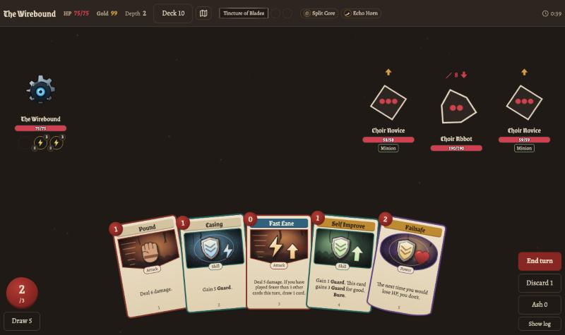
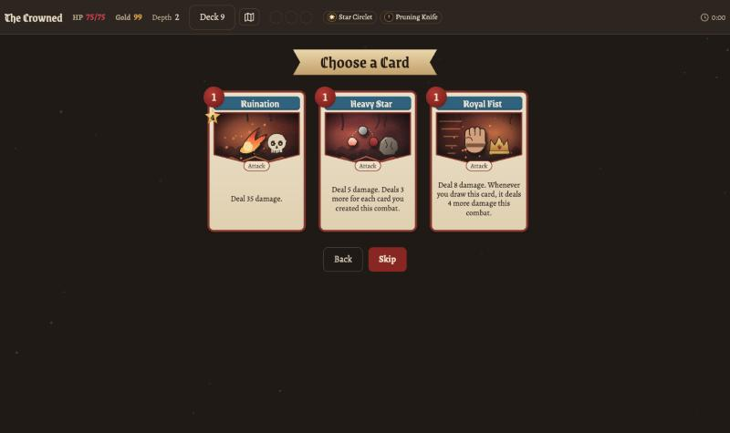
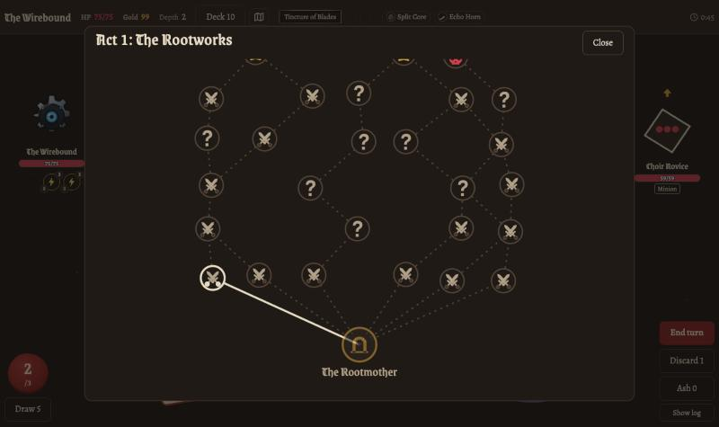
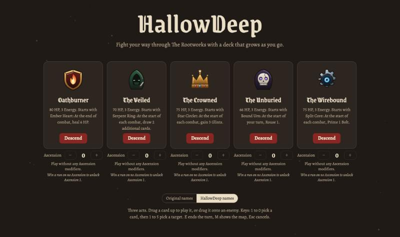

<div align="center">

# HallowDeep

**A Slay the Spire clone you can play in your browser.**

### [▶ Play at hallowdeep.netlify.app](https://hallowdeep.netlify.app/)

No download or account needed.

<table>
<tr>
<td></td>
<td></td>
</tr>
<tr>
<td></td>
<td></td>
</tr>
</table>

</div>

HallowDeep is a clone of Slay the Spire 2: every rule and number follows the game's v0.111 data, with its own
names, card art and interface. Pick one of five heroes, build a deck as you go, and fight your way up three acts.
It runs on desktops, tablets and phones, and saves as you play.

**Coming soon:** co-op for 2 to 4 players.

## Run it locally

```bash
python3 build.py
```

Then open `dist/hallowdeep.html` in a browser. Developer notes are in [CONTRIBUTING.md](CONTRIBUTING.md).

<sub>An unofficial fan project, not affiliated with Mega Crit. Game data from [Spire Codex](https://github.com/ptrlrd/spire-codex). For personal and learning use.</sub>
